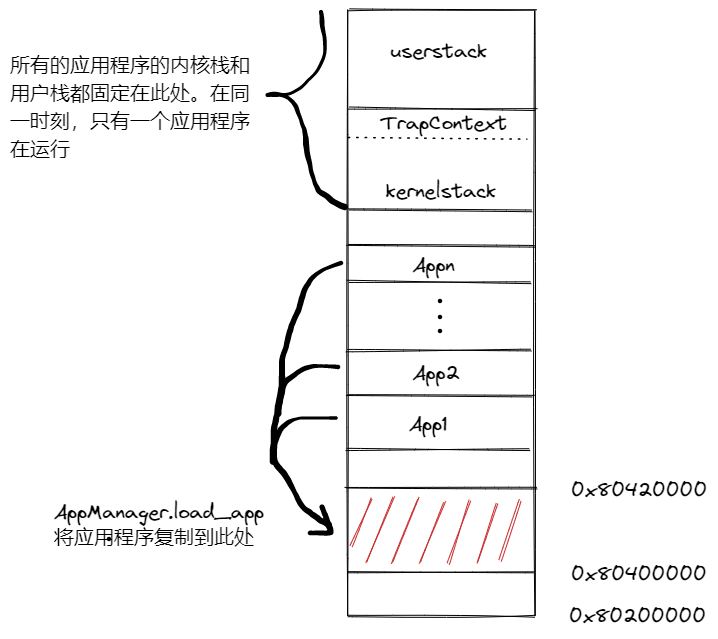

# rCore 实验 - Lab2

### 简介

- 关于 rCore-Tutorial-Book 第一章的一些笔记
- 请搭配 rCore-Tutorial-Book 食用

### 应用程序设计

- 创建与 `OS` 同级的 `User` 目录，`cargo new user --lib`

- 按照实验指导书设置 `.cargo/config` ，添加`src` 目录下的文件，构建应用程序库以及应用程序

  - `bin` 目录下为应用程序，需要在创建的应用程序库 user_lib 的基础上运行（需要将 `Cargo.toml` 中 `name` 设置为 `user_lib`）

    ```
    extern crate user_lib;
    ```

  - `console.rs` 同内核相似，为 `Stdout` 实现 `Write` 特性时，不再使用 `console_putchar` 函数，而是使用 `lib.rs` 提供的系统调用 `write`

    ```
    impl Write for Stdout {
        fn write_str(&mut self, s: &str) -> fmt::Result {
            write(STDOUT, s.as_bytes());
            Ok(())
        }
    }
    ```

  - `lang_items.rs` 与内核相同

  - `lib.rs` 提供系统调用的用户层接口，以及一个弱链接的 `main` 函数（避免没有应用程序时无法编译）

    ```
    use syscall::*;
    pub fn write(fd: usize, buf: &[u8]) -> isize {
        sys_write(fd, buf)
    }
    pub fn exit(exit_code: i32) -> isize {
        sys_exit(exit_code)
    }
    
    #[linkage = "weak"]
    #[no_mangle]
    fn main() -> i32 {
        panic!("Cannot find main!");
    }
    ```

  - `linker.ld` 规定应用程序编译的起始地址（`0x80400000`）以及内存布局

  - `syscall.rs` ，用户层的系统调用根据各自的 `syscall_id` 从统一的 `syscall` 函数进入内核，与内核 `sbi.rs` 相同，若系统调用有返回值，则是通过 `x10` 寄存器来返回

    ```
    fn syscall(id: usize, args: [usize; 3]) -> isize {
        let mut ret: isize;
        unsafe {
            asm!(
                "ecall",
                inlateout("x10") args[0] => ret,
                in("x11") args[1],
                in("x12") args[2],
                in("x17") id
            );
        }
        ret
    }
    ```

### 批处理操作系统

- 将应用程序的二进制镜像文件链接到内核中

  - `os/build.rs`  脚本生成汇编文件 `os/src/link_app.S`，然后通过 `link_app.S` 将应用程序 `user/src/bin/*.rs` 编译出来的去掉元信息的二进制文件链接到内核的数据段中，并且添加相关的起始地址等信息，方便之后管理应用程序

    ```
    .align 3
        .section .data
        .global _num_app
    _num_app:
        .quad 5
        .quad app_0_start
        .quad app_1_start
        .quad app_2_start
        .quad app_3_start
        .quad app_4_start
        .quad app_4_end
    
        .section .data
        .global app_0_start
        .global app_0_end
    app_0_start:
        .incbin "../user/target/riscv64gc-unknown-none-elf/release/00hello_world.bin"
    app_0_end:
    	……
    ```

- `sync` 子模块，保证在单核上安全使用可变全局变量

- `syscall` 子模块，目前只实现了 `sys_write`、`sys_exit` 
  - `sys_write` ：根据传递的字符串指针参数，得到字符串，最后调用 `print！` 宏打印到屏幕
  - `sys_exited` ：`exit(main())` 语句，应用程序执行完之后，会执行 `exit()` 系统调用，进行切换
  
- `trap` 子模块，完成特权级转换过程中的上下文保存与恢复，以及发生中断、异常、系统调用时的处理
  - `TrapContext` 保存上一个特权级上下文，需要保存通用寄存器，`pc` 以及 `sstatus` 寄存器
  
    ```
    #[repr(C)]
    pub struct TrapContext {
        pub x: [usize; 32],		// 通用寄存器
        /// CSR sstatus      
        pub sstatus: Sstatus,	// 保存某些特权级信息
        /// CSR sepc
        pub sepc: usize,		// 保存发生中断、异常、系统调用的指令位置
    }
    ```
  
  - `TrapContext.app_init_context` 用于应用程序初始化，之后再无其他用处；CPU 只能通过 `*ret` 的方式从高特权级进入低特权级，因此需要先提供低特权级模式下的上下文，将其中的 `pc`、`sp` 设置为期望的应用程序的入口和用户栈顶，并且将 `sstatus` 设置为用户态
  
    ```
    impl TrapContext {
        /// set stack pointer to x_2 reg (sp)
        pub fn set_sp(&mut self, sp: usize) {
            self.x[2] = sp;
        }
        /// init app context
        pub fn app_init_context(entry: usize, sp: usize) -> Self {
            let mut sstatus = sstatus::read(); // 先读取 sstatus 寄存器
            sstatus.set_spp(SPP::User); // 设置特权级为用户态
            let mut cx = Self {
                x: [0; 32],
                sstatus,
                sepc: entry, // 初始化 pc 为应用程序的入口
            };
            cx.set_sp(sp); // 设置应用程序的用户栈
            cx 
        }
    }
    ```
  
  - `trap.S` 进入和退出内核时，执行保存上下文和切换栈的操作
  
    - `__alltraps` 函数
  
      ```
      __alltraps:
          csrrw sp, sscratch, sp
          # 从用户态的栈切换到内核态的栈，sscratch 寄存器将保存用户态的栈指针
          # 在内核栈中申请 TrapContext 大小的空间
          addi sp, sp, -34*8
          # 保存通用寄存器
          sd x1, 1*8(sp)
          sd x3, 3*8(sp)
          .set n, 5
          .rept 27
              SAVE_GP %n
              .set n, n+1
          .endr
          # 将用户态的 sstatus、sepc、sscratch（实际为用户栈指针）保存到上下文中
          csrr t0, sstatus
          csrr t1, sepc
          sd t0, 32*8(sp)
          sd t1, 33*8(sp)
          csrr t2, sscratch
          sd t2, 2*8(sp)
          # 此时 sp 指向的是内核栈，同时也是 TrapContext 上下文的起始地址
          # 将其作为参数传递给 trap_handler(cx: &mut TrapContext) 函数
          mv a0, sp
          call trap_handler
      ```
  
    - `__restore` 函数
  
    ```
    __restore:
        # __restore 函数只在两种情况下使用
        # 一是应用程序第一次运行；而是从应用程序进入内核后返回用户态
        
        # 传递进来的参数 a0 指向内核栈顶，同时是 TrapContext 上下文的起始地址
        mv sp, a0
        # 从 TrapContext 中恢复上下文，首先恢复 sstatus、sepc、sscratch 寄存器
        # sscratch 寄存器指向用户栈
        ld t0, 32*8(sp)
        ld t1, 33*8(sp)
        ld t2, 2*8(sp)
        csrw sstatus, t0
        csrw sepc, t1
        csrw sscratch, t2
        # 恢复通用寄存器
        ld x1, 1*8(sp)
        ld x3, 3*8(sp)
        .set n, 5
        .rept 27
            LOAD_GP %n
            .set n, n+1
        .endr
        # 释放掉内核栈中 TrapContext 的空间
        addi sp, sp, 34*8
        # 从内核栈切换到用户栈，sscratch 将保存内核栈指针
        csrrw sp, sscratch, sp
        sret
    ```
  
  - `mod.rs` 完成具体的 `trap_handler` 过程，并且完成 `trap` 模块的初始化，将 `__alltraps` 函数的地址写入 `stvec` 寄存器，发生中断、异常、系统调用时，`CPU` 会自动跳转到 `__alltraps` 处
  
    ```
    /// 将 __alltraps 函数的地址写入 stvec 寄存器
    pub fn init() {
        extern "C" {
            fn __alltraps();
        }
        unsafe {
            stvec::write(__alltraps as usize, TrapMode::Direct);
        }
    }
    
    #[no_mangle]
    /// 处理来自用户态的中断、异常、系统调用
    pub fn trap_handler(cx: &mut TrapContext) -> &mut TrapContext {
        let scause = scause::read(); // 获取保存在 scause 中保存的发生异常的原因
        let stval = stval::read(); // 获取 stval 中的额外信息
        match scause.cause() {
        	// 若是系统调用，则需要将 pc + 4，然后执行相应的系统调用，将返回值保存在上下文中
            Trap::Exception(Exception::UserEnvCall) => {
                cx.sepc += 4;
                cx.x[10] = syscall(cx.x[17], [cx.x[10], cx.x[11], cx.x[12]]) as usize;
            }
            // 若为保存加载异常、执行非法指令异常，则内核直接杀死应用程序，执行下一个
            Trap::Exception(Exception::StoreFault) | Trap::Exception(Exception::StorePageFault) => {
                println!("[kernel] PageFault in application, kernel killed it.");
                run_next_app();
            }
            Trap::Exception(Exception::IllegalInstruction) => {
                println!("[kernel] IllegalInstruction in application, kernel killed it.");
                run_next_app();
            }
            _ => {
                panic!(
                    "Unsupported trap {:?}, stval = {:#x}!",
                    scause.cause(),
                    stval
                );
            }
        }
        cx
    }
    ```
  
- `batch.rs` 批处理系统

  - 根据 `link_app.S` 中的信息来构建 `AppManager` 

    ```
    struct AppManager {
        num_app: usize,
        current_app: usize,
        app_start: [usize; MAX_APP_NUM + 1],
    }
    lazy_static! {
        static ref APP_MANAGER: UPSafeCell<AppManager> = unsafe {
            UPSafeCell::new({
                extern "C" {
                    fn _num_app();
                }
                let num_app_ptr = _num_app as usize as *const usize;
                let num_app = num_app_ptr.read_volatile();
                let mut app_start: [usize; MAX_APP_NUM + 1] = [0; MAX_APP_NUM + 1];
                let app_start_raw: &[usize] =
                    core::slice::from_raw_parts(num_app_ptr.add(1), num_app + 1);
                app_start[..=num_app].copy_from_slice(app_start_raw);
                AppManager {
                    num_app,
                    current_app: 0,
                    app_start,
                }
            })
        };
    }
    ```

  - 初始化应用程序的内核栈和用户栈，均为 `8KB`，且都实现了 `get_sp()` 方法，内核栈 `KernelStack` 实现了 `push_context(cx: TrapContext)` 方法。目前还没有实现内存分配，因此直接将内核栈和用户栈编译进内核的数据段中

    ```
    static KERNEL_STACK: KernelStack = KernelStack {
        data: [0; KERNEL_STACK_SIZE],
    };
    impl KernelStack {
        fn get_sp(&self) -> usize {
            self.data.as_ptr() as usize + KERNEL_STACK_SIZE
        }
        pub fn push_context(&self, cx: TrapContext) -> &'static mut TrapContext {
            let cx_ptr = (self.get_sp() - core::mem::size_of::<TrapContext>()) as *mut TrapContext;
            unsafe {
                *cx_ptr = cx;
            }
            unsafe { cx_ptr.as_mut().unwrap() }
        }
    }
    ```

  - AppManager 从内核数据段中加载应用程序到 `APP_BASE_ADDRESS(0x80400000)` 处 

    ```
    unsafe fn load_app(&self, app_id: usize) {
        if app_id >= self.num_app {
        	panic!("All applications completed!");
        }
        println!("[kernel] Loading app_{}", app_id);
        asm!("fence.i");
        core::slice::from_raw_parts_mut(APP_BASE_ADDRESS as *mut u8, APP_SIZE_LIMIT).fill(0);
        let app_src = core::slice::from_raw_parts(
        self.app_start[app_id] as *const u8,
        self.app_start[app_id + 1] - self.app_start[app_id],
        );
        let app_dst = core::slice::from_raw_parts_mut(APP_BASE_ADDRESS as *mut u8, app_src.len());
        app_dst.copy_from_slice(app_src);
    }
    ```

  - `run_next_app()` 调用 `app_manager.load_app(current_app)` 加载应用程序，然后在应用程序的内核栈中准备好 `TrapContext` 

    ```
    pub fn run_next_app() -> ! {
        let mut app_manager = APP_MANAGER.exclusive_access();
        let current_app = app_manager.get_current_app();
        unsafe {
            app_manager.load_app(current_app);
        }
        app_manager.move_to_next_app();
        drop(app_manager);
        // before this we have to drop local variables related to resources manually
        // and release the resources
        extern "C" {
            fn __restore(cx_addr: usize);
        }
        unsafe {
            __restore(KERNEL_STACK.push_context(TrapContext::app_init_context(
                APP_BASE_ADDRESS,		// 应用程序入口地址
                USER_STACK.get_sp(),	// 应用程序用户栈
            )) as *const _ as usize);
        }
        panic!("Unreachable in batch::run_current_app!");
    }
    ```

### 批处理系统示意图



### 实验练习，sys_write 安全检查

- 应用程序本身内存空间的数据有两类，一类是直接编译在 `elf` 文件的 `data` 、`bss` 段中，另一类则是在应用程序的用户栈中，因此进行安全检查时，需要检查指针是否指向这两个内存空间（注意：需要将 `UserStack` 相关的数据结构与方法声明为 `pub`类型）

  ```
  const FD_STDOUT: usize = 1;
  const APP_BASE_ADDRESS: usize = 0x80400000;
  const APP_SIZE_LIMIT: usize = 0x20000;
  use crate::batch::{USER_STACK};
  const USER_STACK_SIZE: usize = 4096;
  
  /// write buf of length `len`  to a file with `fd`
  pub fn sys_write(fd: usize, buf: *const u8, len: usize) -> isize {
      match fd {
          FD_STDOUT => {
              if (((buf as usize)  >= USER_STACK.get_sp() - USER_STACK_SIZE) && ((buf as usize) + len <= USER_STACK.get_sp())) 
              || (((buf as usize) + len <= APP_SIZE_LIMIT + APP_BASE_ADDRESS) && ((buf as usize) >= APP_BASE_ADDRESS)){
                  let slice = unsafe { core::slice::from_raw_parts(buf, len) };
                  let str = core::str::from_utf8(slice).unwrap();
                  print!("{}", str);
                  len as isize
              }else{
                  -1 as isize
              }
          }
          _ => {
          	-1 as isize
              // panic!("Unsupported fd in sys_write!");
          }
      }
  }
  ```

- 实验结果，通过所有用户测例

  
