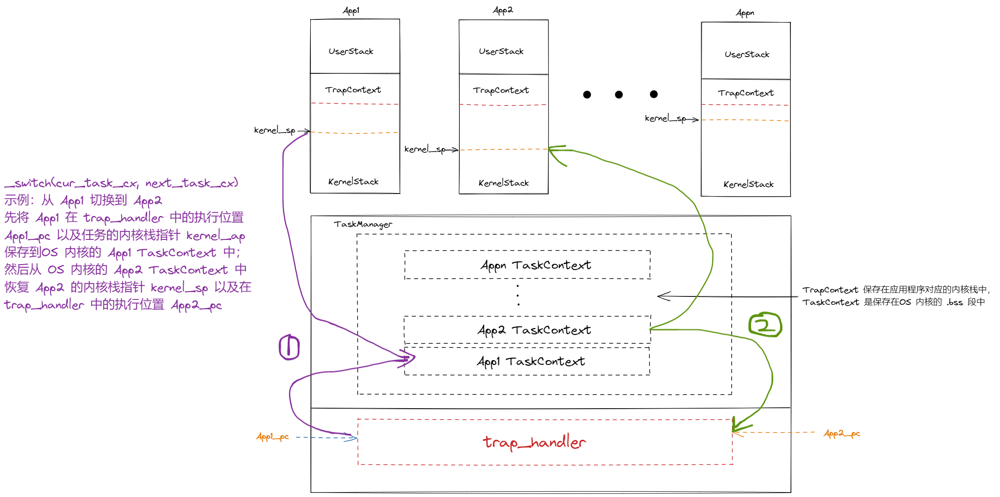
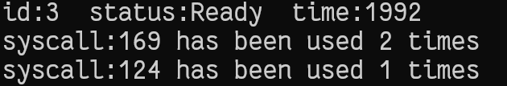
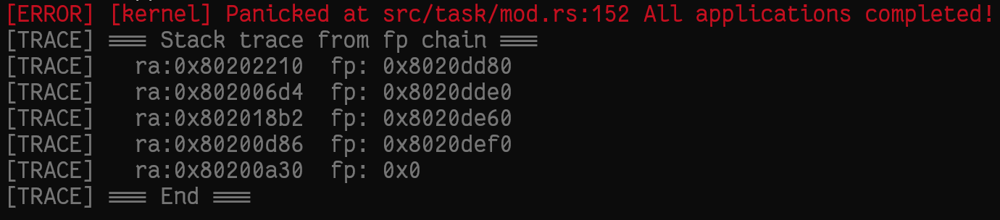

# rCore 实验 - Lab3

### 简介

- 关于 rCore-Tutorial-Book 第三章的一些笔记
- 请搭配 rCore-Tutorial-Book 食用

### 应用程序编译链接

- 在 `user` 目录下新增了 `build.py` 文件，生成每个应用程序对应的 `link.ld` 文件，并将应用程序逐个编译链接，使得应用程序的起始地址不再相同，在 `Makefile` 中执行 `build.py` 脚本


- 在 `syscall.rs` 和 `lib.rs` 中添加 `sys_get_time` 和 `sys_yield` 系统调用的用户层接口

### 内核支持多道程序

- 将应用程序的二进制镜像文件链接到内核中，与第二章相同

- 用 `loader` 子模块替换 `batch` 子模块，加载应用程序到不同的地址

  ```rust
  /// 加载第 i 个应用程序到 [0x80400000 + i * 0x20000, 0x80400000 + (i + 1) * 0x20000)
  pub fn load_apps() {
      extern "C" {
          fn _num_app();
      }
      let num_app_ptr = _num_app as usize as *const usize;
      let num_app = get_num_app();
      let app_start = unsafe { core::slice::from_raw_parts(num_app_ptr.add(1), num_app + 1) };
      // clear i-cache first
      unsafe {
          asm!("fence.i");
      }
      // load apps
      for i in 0..num_app {
          let base_i = get_base_i(i);
          // clear region
          (base_i..base_i + APP_SIZE_LIMIT)
              .for_each(|addr| unsafe { (addr as *mut u8).write_volatile(0) });
          // load app from data section to memory
          let src = unsafe {
              core::slice::from_raw_parts(app_start[i] as *const u8, app_start[i + 1] - app_start[i])
          };
          let dst = unsafe { core::slice::from_raw_parts_mut(base_i as *mut u8, src.len()) };
          dst.copy_from_slice(src);
      }
  }
  ```

- 为每个应用程序准备好各自的内核栈和用户栈

  ```rust
  struct KernelStack {
      data: [u8; KERNEL_STACK_SIZE],
  }
  #[repr(align(4096))]
  #[derive(Copy, Clone)]
  struct UserStack {
      data: [u8; USER_STACK_SIZE],
  }
  static KERNEL_STACK: [KernelStack; MAX_APP_NUM] = [KernelStack {
      data: [0; KERNEL_STACK_SIZE],
  }; MAX_APP_NUM];
  static USER_STACK: [UserStack; MAX_APP_NUM] = [UserStack {
      data: [0; USER_STACK_SIZE],
  }; MAX_APP_NUM];
  /// 在应用程序的内核栈中压入 TrapContext，设置应用程序入口以及用户栈
  pub fn init_app_cx(app_id: usize) -> usize {
      KERNEL_STACK[app_id].push_context(TrapContext::app_init_context(
          get_base_i(app_id),
          USER_STACK[app_id].get_sp(),
      ))
  }
  ```

- 在 `config.rs` 文件中设置好应用程序的相关信息，并且设置好时钟中断

### 任务切换

- 创建 `task` 子模块

  - `context.rs`  负责保存内核进程切换时的上下文`TaskContext`，包括`ra`、`sp`、`s0 ~ s11`，`goto_restore(kstack_ptr)` 函数设置 `TaskContext` 的返回地址为 `__restore`，内核栈为 `kstack_ptr`

    ```rust
    #[derive(Copy, Clone)]
    #[repr(C)]
    pub struct TaskContext {
        ra: usize,
        sp: usize,
        s: [usize; 12],
    }
    ```

    ```rust
    pub fn goto_restore(kstack_ptr: usize) -> Self {
    	extern "C" {
    		fn __restore();
    	}
    	Self {
    		ra: __restore as usize,
    		sp: kstack_ptr,
    		s: [0; 12],
    	}
    }
    ```

  - `switch.S` 以及 `switch.rs` 完成内核进程切换上下文的保存与恢复

    ```rust
    __switch:
        # __switch(cur_task_cx, next_task_cx)
        # a0: cur_task_cx    a1: next_task_cx
        # 保存当前任务的上下文
        sd sp, 8(a0)
        sd ra, 0(a0)
        .set n, 0
        .rept 12
            SAVE_SN %n
            .set n, n + 1
        .endr
        # 恢复下一个任务的上下文
        ld ra, 0(a1)
        .set n, 0
        .rept 12
            LOAD_SN %n
            .set n, n + 1
        .endr
        ld sp, 8(a1)
        ret
    ```

  - `task.rs` 构建任务控制块 `TaskControlBlock`，包括任务的状态和任务切换的上下文

  - `mod.rs` 创建任务管理器 `TaskManager`，提供进程切换的相关接口

    - `TaskManager` ，内部是一个 `TCB` 向量

      ```rust
      pub struct TaskManager {
          num_app: usize,
          inner: UPSafeCell<TaskManagerInner>,
      }
      pub struct TaskManagerInner {
          tasks: [TaskControlBlock; MAX_APP_NUM],
          current_task: usize,
      }
      lazy_static! {
          pub static ref TASK_MANAGER: TaskManager = {
              let num_app = get_num_app();
              let mut tasks = [TaskControlBlock {
                  task_cx: TaskContext::zero_init(),
                  task_status: TaskStatus::UnInit,
              }; MAX_APP_NUM];
              for (i, task) in tasks.iter_mut().enumerate() {
                  task.task_cx = TaskContext::goto_restore(init_app_cx(i));
                  task.task_status = TaskStatus::Ready;
              }
              TaskManager {
                  num_app,
                  inner: unsafe {
                      UPSafeCell::new(TaskManagerInner {
                          tasks,
                          current_task: 0,
                      })
                  },
              }
          };
      }
      ```

- 添加时钟中断，支持抢占式调度

  - 添加 `board` 模块，设置时钟频率
  - 在 `sbi.rs` 中添加相关的时钟函数，添加`timer` 子模块，提供相应的接口
  - 在 `trap/mod.rs` 中添加时钟中断的处理过程，具体是设置下一次产生时钟中断的时刻，把当前任务挂起，然后运行下一个任务

- `trap/trap.S` 

### 任务切换 __switch(cur_task_cx, next_task_cx)



​		当应用程序第一次运行时，`TaskContext` 的 `ra` 被设置 `__restore`，进而进入用户态；若应用程序执行一段时间后，时间片用完，则进入 `trap_handler`，调用 `_switch` ，则会将 `__switch` 的下一条指令地址作为 `ra` 保存到 `TaskContext` 中，若下一次切换到这个应用程序，则会从 `run_next_task` 返回到 `trap_handler`，再返回到 `__alltraps` 中，进而顺序执行到 `__restore` 函数，此时应用内核栈的函数调用均已经结束，此时的 `sp` 指向的就是应用内核栈中保存的 TrapContext 的首地址，因此就可以直接从此处恢复用户态的上下文

### 实验练习

- 获取任务信息

  - 在 `task/task.rs` 建立 `TaskInfo` 数据结构，并在 `TCB` 中添加相关的信息

    ```rust
    pub const MAX_SYSCALL_NUM : usize = 100;		// 支持的 syscall 的最大数量
    #[derive(Copy, Clone)]
    pub struct SyscallInfo {
    	pub id: usize,					// syscall_id
    	pub times: usize,				// 使用的系统调用次数
    }
    impl SyscallInfo {
    	pub fn new() -> Self{
    		SyscallInfo {
    			id: 0,
    			times: 0,
    		}
    	}
    }
    
    #[derive(Copy, Clone)]
    pub struct TaskInfo {
    	pub id: usize, 		// 任务 id
    	pub status: TaskStatus,	  // 任务状态
    	pub call: [SyscallInfo; MAX_SYSCALL_NUM],  // 任务使用的系统调用信息
    	pub time: usize,  // 任务运行的总时间
    }
    impl TaskInfo {
    	pub fn new() -> Self{
    		TaskInfo {
    			id: 0,
    			status: TaskStatus::Ready,
    			call: [SyscallInfo::new(); MAX_SYSCALL_NUM],
    			time: 0,
    		}
    	}
    }
    ```
    
  - `syscall` 模块的 `process.rs` 中添加相应的接口，没有建立地址空间隔离，因此这里是对应用程序的内存区域中的 TaskInfo 直接进行修改

    ```rust
    pub fn sys_get_task_info(id: usize, ts: *mut TaskInfo) -> isize {
        get_task_info(id, ts)
    }
    ```

  - 在 `task/mod.rs` 中实现 `get_task_info(id, ts)` 函数，获取对应的信息

    ```rust
    pub fn get_task_info(id: usize, ts: *mut TaskInfo) -> isize {
        TASK_MANAGER.get_task_info(id, ts)
    }
    fn get_task_info(&self, id: usize, ts: *mut TaskInfo) -> isize {
    	let inner = self.inner.exclusive_access();
        if id >= self.num_app {
        	return -1;
        }
        unsafe {
        	(*ts).id = id;
            (*ts).status = inner.tasks[id].task_status;
            (*ts).call = inner.tasks[id].task_info.call;
            (*ts).time = inner.tasks[id].task_info.time;
        }
        0
    }
    ```

  - 更新应用程序的系统调用信息，应用程序一旦执行系统调用，在 `trap_handler` 中先执行 `record_current_task_syscall` 记录其信息，再执行对应的系统调用

    ```rust
    Trap::Exception(Exception::UserEnvCall) => {
    	record_current_task_syscall(cx.x[17]);
        cx.sepc += 4;
        cx.x[10] = syscall(cx.x[17], [cx.x[10], cx.x[11], cx.x[12]]) as usize;
    }
    ```

    ```rust
    pub fn record_current_task_syscall(syscall_id: usize) {
        TASK_MANAGER.record_current_task_syscall(syscall_id);
    }
    fn record_current_task_syscall(&self, syscall_id: usize) {
        let mut inner = self.inner.exclusive_access();
        let current = inner.current_task;
        let mut idx = 0;
        for i in 0..MAX_SYSCALL_NUM {
        	if inner.tasks[current].task_info.call[i].id == 0 {
        		idx = i;
        		break;
        	} else if inner.tasks[current].task_info.call[i].id == syscall_id {
        		idx = i;
        		break;
        	}
        };
        inner.tasks[current].task_info.call[idx].id = syscall_id;
        inner.tasks[current].task_info.call[idx].times += 1;
    }
    ```

  - 更新应用程序运行时间，在进行切换之前，更新上一个应用的运行时间，设置下一个应用的 `last_start_time`（注意：需要在 `run_first_task` 和 `run_next_task`中添加相应的逻辑）

    ```rust
    // run_first_task
    task0.task_info.last_start_time = get_time();
    
    // run_next_task
    let now = get_time();
    inner.tasks[current].task_info.time += now - 	
    						inner.tasks[current].last_start_time;
    inner.tasks[next].last_start_time = now;
    ```

  - 在应用程序库中添加相关接口

  ##### 注意：在运行时需要修改 `config.rs` 中的相关配置

  - 实验结果，在统计 `sys_write` 系统调用时与期望的值不同，与格式串中的参数有关，例如:

    ```rust
    println!("power_3 [{}/{}]", i, iter);	// times + 5
    println!("{}^{} = {}(MOD {})", p, iter, s[cur], m);		// times + 8
    println!("Test power_3 OK!");		// times + 1
    ```

    


- 打印调用堆栈

  - 添加 `stack_trace` 子模块，并在 `panic` 时打印调用链，函数调用压栈时，编译器会加上 `ra` 和上一个 `fp`，因此只需要获取当前的 `fp` 即可获得相应的信息，然后迭代即可

    ```rust
    use core::{arch::asm, ptr};
    #[inline(always)]
    pub fn print_stack_trace() {
        // 获取到栈帧指针
        let mut fp: *const usize;
        unsafe {
            asm!(
                "mv {fp}, fp",
                fp = out(reg) fp,
            );
            log::trace!("=== Stack trace from fp chain ===");
            while fp != ptr::null() {
    
                log::trace!("  ra:{:#x}  fp: {:#x}", *(fp.sub(1)), *(fp.sub(2)));
                fp = *(fp.sub(2)) as *const usize;
            }
            log::trace!("=== End ===\n\n");
        }
    }
    ```

  - 实验结果

    

​			
