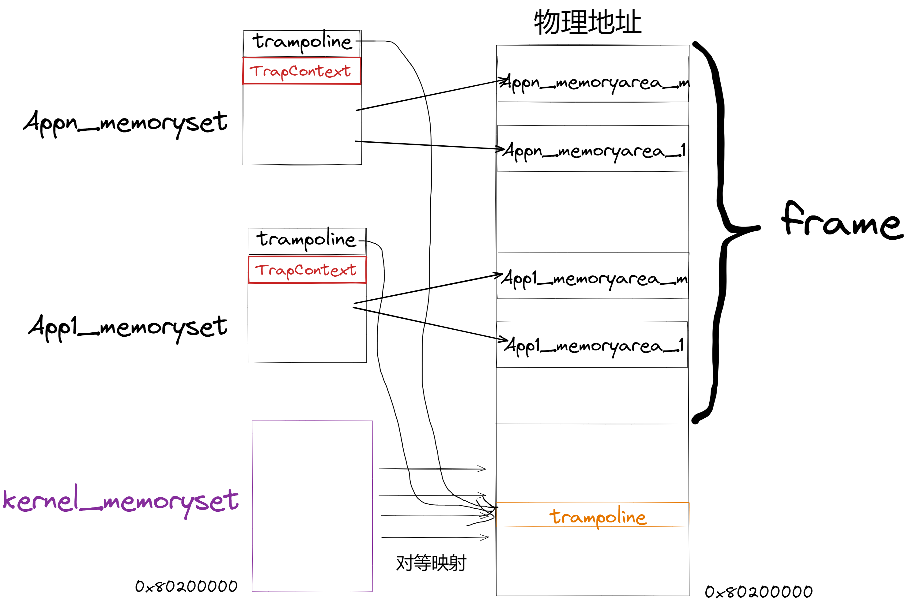
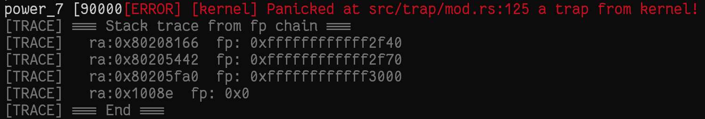
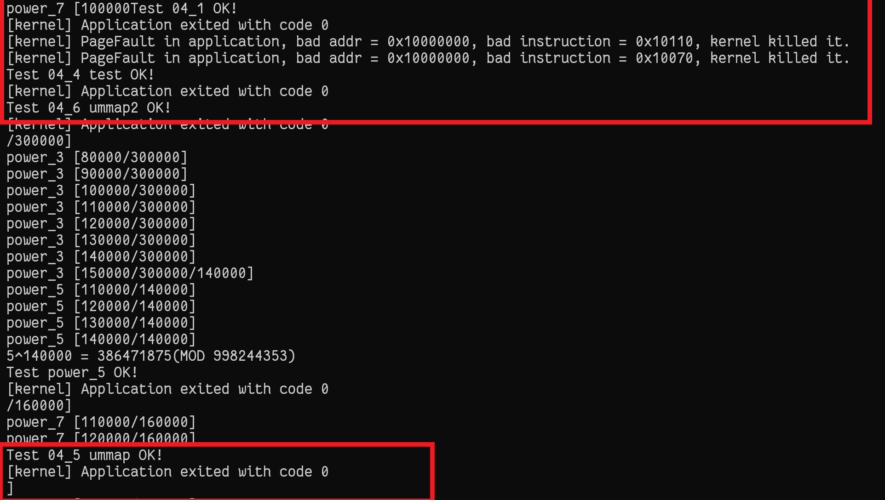

# rCore 实验 - Lab4

### 简介

- 关于 rCore-Tutorial-Book 第四章的一些笔记
- 请搭配 rCore-Tutorial-Book 食用

### 让内核支持动态内存分配

- 添加 `buddy_system_allocator` 、`alloc` 依赖

- 在 `mm` 子模块中实现 `HEAP_ALLOCATOR`


### 完成地址空间的抽象（mm 子模块）

- `address.rs` 实现地址相关的数据的抽象与类型定义，实现相关的数据类型的转换

  - PhyAddr

  - VirtAddr

  - PhysPageNum 向外提供了三个接口，根据 `PPN` 来获取对应的信息

    >  `get_pte_array`：获取物理页框中的 `PTE` 数组
    >
    > `get_bytes_array`：将物理页框中的转化为字节数组
    >
    > `get_mut<T>`：将物理页框转化为类型 `T`

  - VirtPageNum

    > 实现了 `SimpleRange<VirtPageNum>`，表示一个连续的虚拟地址

- `page_table.rs` 实现页表的相关操作

  - `PageTableEntry` 提供了页表项的相关函数

    > `new` ：根据 `PPN` 以及 `PTEFlags` 构造页表项
    >
    > `empty`：判断页表是否为空
    >
    >   `ppn`：获得对应的 `PPN`
    >
    > `flags`：获取属性位
    >
    >   `is_valid`：判断 `PTE` 是否合法
    >
    >   `readable`：判断 `PTE` 是否可读
    >
    >   `writable`：判断 `PTE` 是否可写
    >
    >   `executable`：判断 `PTE` 是否可执行

  - `PageTable` 提供页表相关函数

    > `new`：申请一个物理页作为页表
    >
    > `from_token`：根据用户的地址空间构建一个临时的页表，用来获取用户地址空间的参数
    >
    > `find_pte_create`：（private）找到对应的 `PTE`，若 `PTE` 非法，则申请一个页来构造
    >
    > `find_pte`：（private）找到对应的 `PTE`
    >
    > `map`：建立虚拟地址和物理地址之间的映射
    >
    > `unmap`：解除虚拟地址的映射，对应的物理地址会自动回收
    >
    > `translate`：根据虚拟地址，得到对应的 `PTE`
    >
    > `token`：获取当前页表的 satp

  - `translated_byte_buffer` 将用户地址空间的缓冲区数据转化到内核地址空间中

- `frame_allocator.rs` 提供了一个栈式的物理页框分配器，向外提供 `init_frame_allocator`、`frame_alloc`、`frame_dealloc` 函数

- `memory_set.rs` 实现地址空间的抽象和类型定义

  - `MemorySet` 表示地址空间，地址空间由页表以及许多个离散的 `MapArea` 构成

    ```
    pub struct MemorySet {
        page_table: PageTable,
        areas: Vec<MapArea>,
    }
    ```

    > `new_bare`：创建一个空的地址空间
    >
    > `token`：获取地址空间的 satp
    >
    > `insert_framed_area`：插入内核对等映射的区域
    >
    > `push`：向地址空间中插入 `MapArea` 
    >
    > `map_trampoline`：向地址空间中插入 `trampoline` 
    >
    > `new_kernel`：构造 `kernel` 的地址空间
    >
    > `from_elf`：根据应用程序的 `elf` 文件来构造地址空间
    >
    > `activate`：激活地址空间
    >
    > `translate`：将 `VPN` 转化为对应的 `PTE`

  - `MapArea` 表示一块连续的虚拟地址

    ```
    pub struct MapArea {
        vpn_range: VPNRange,
        data_frames: BTreeMap<VirtPageNum, FrameTracker>,
        map_type: MapType,
        map_perm: MapPermission,
    }
    ```

    > `new`：创建新的虚拟地址区域
    >
    > `map_one`：在页表中建立与 `VPN` 对应的映射关系
    >
    > `unmap_one`：在页表中解除与 `VPN` 对应的映射关系
    >
    > `map`：在页表中建立这一块虚拟地址区域的映射关系
    >
    > `unmap`：在页表中解除这一块虚拟地址区域的映射关系
    >
    > `copy_data`：复制数据到建立的地址映射关系的物理地址处

- `mod.rs` 完成堆内存管理器、物理页框分配器、内核地址空间的初始化

### 让应用程序拥有地址空间（task 子模块）

- `TCB` 中增加地址空间等相关信息，并实现相关的方法

  ```
  pub struct TaskControlBlock {
      pub task_status: TaskStatus,
      pub task_cx: TaskContext,
      pub task_info: TaskInfo,
  	pub last_start_time: usize,
  	pub memory_set: MemorySet,
      pub trap_cx_ppn: PhysPageNum,	// 进程 TrapContext 所在的物理页
      pub base_size: usize,
  }
  ```

  > `get_trap_cx`：根据 `trap_cx_ppn` 获取 `TrapContext`
  >
  > `get_user_token`：获取进程地址空间的 satp
  >
  > `new`：根据进程的 `elf` 文件构造进程 `TCB`

- 任务管理器 `TASK_MANAGER` 初始化时采用动态内存分配，并且根据应用程序的 `elf` 文件来构造应用程序的地址空间，并且增加管理当前进程的相关方法： `get_current_token`、`get_current_trap_cx` 

  ```
  pub static ref TASK_MANAGER: TaskManager = {
  	println!("init TASK_MANAGER");
      let num_app = get_num_app();
      println!("num_app = {}", num_app);
      let mut tasks: Vec<TaskControlBlock> = Vec::new();
      for i in 0..num_app {
      	tasks.push(TaskControlBlock::new(get_app_data(i), i));
      }
      TaskManager {
      	num_app,
          inner: unsafe {
          	UPSafeCell::new(TaskManagerInner {
              	tasks,
                  current_task: 0,
              })
          },
      }
  };
  ```

  ```
  fn get_current_token(&self) -> usize {
  	let inner = self.inner.exclusive_access();
      inner.tasks[inner.current_task].get_user_token()
  }
  fn get_current_trap_cx(&self) -> &'static mut TrapContext {
  	let inner = self.inner.exclusive_access();
      inner.tasks[inner.current_task].get_trap_cx()
  }
  ```

### 从内核进入用户态，完成地址空间切换（trap 子模块）

- `TrapContext` 数据结构增加相关信息，并修改 `app_init_context` 函数，保证切换地址空间后能够完成处理

  ```
  pub struct TrapContext {
      pub x: [usize; 32],
      pub sstatus: Sstatus,
      pub sepc: usize,
      pub kernel_satp: usize,    // 内核的地址空间
      pub kernel_sp: usize,      // 应用程序的内核栈指针
      pub trap_handler: usize,   // trap_handler 函数地址
  }
  ```

  ```
  pub fn app_init_context(
      entry: usize,
      sp: usize,
      kernel_satp: usize,
      kernel_sp: usize,
      trap_handler: usize,
  ) -> Self {
      let mut sstatus = sstatus::read(); // CSR sstatus
      sstatus.set_spp(SPP::User); //previous privilege mode: user mode
      let mut cx = Self {
      	x: [0; 32],
      	sstatus,
      	sepc: entry,  // entry point of app
      	kernel_satp,  // addr of page table
     		kernel_sp,    // kernel stack
      	trap_handler, // addr of trap_handler function
      };
      cx.set_sp(sp); // app's user stack pointer
      cx // return initial Trap Context of app
  }
  ```

-  `trap.S` 中的 `__alltraps` 、 `__restore` 函数增加地址空间切换的过程，将 `TrapContext` 保存到应用程序的地址空间中，而不是简单的保存在应用程序内核栈中

  ```
  __alltraps:
  	……
      csrw satp, t0
      sfence.vma
      # jump to trap_handler
      jr t1
  __restore:
  	csrw satp, a1
      sfence.vma
      csrw sscratch, a0
      ……
  ```

- `mod.rs` 增加在内核态发生中断、异常的处理过程，提前梳理好框架，一边后续实验

  ```
  pub fn init() {
      set_kernel_trap_entry();
  }
  
  fn set_kernel_trap_entry() {
      unsafe {
          stvec::write(trap_from_kernel as usize, TrapMode::Direct);
      }
  }
  
  pub fn trap_handler() -> ! {
      set_kernel_trap_entry();
      ……
      trap_return();
  }
  pub fn trap_return() -> ! {
      set_user_trap_entry();
      let trap_cx_ptr = TRAP_CONTEXT;
      let user_satp = current_user_token();
      extern "C" {
          fn __alltraps();
          fn __restore();
      }
      let restore_va = __restore as usize - __alltraps as usize + TRAMPOLINE;
      unsafe {
          asm!(
              "fence.i",
              "jr {restore_va}",  // jump to new addr of __restore asm function
              restore_va = in(reg) restore_va,
              in("a0") trap_cx_ptr,      // a0 = virt addr of Trap Context
              in("a1") user_satp,        // a1 = phy addr of usr page table
              options(noreturn)
          );
      }
  }
  ```

  `trap_return` 函数先计算处 `__restore` 函数的物理地址，然后进行跳转

### rCore 的地址空间设置以及带来的问题及其解决方案

- `rCore` 地址空间，内核采取的是对等映射，减少了进入内核时 `bootloader` 的负担，（`riscv` 没有了段机制，内核如果不采用对等映射，那么就只能在 `bootloader` 先建立好地址映射关系，并且这种映射关系也是固定的，并不是随机的，所以直接建立对等映射）；应用程序的地址空间则是随机的

  

- 地址空间隔离带来的问题

  - 如何实现跳转

    > 建立跳板机制，在物理内存中专门申请一个物理页，里面是 `__alltraps` 和 `__restore` 函数，所有的应用程序都共用这一个物理页，其虚拟地址为应用程序自己地址空间的最高页

    ```
    .section .text.trampoline
    .globl __alltraps
    .globl __restore
    ```

  - `TrapContext` 保存在应用程序地址空间中，内核无法直接对其进行修改

    > 在应用程序的 `TCB` 中专门保存了 `TrapContext` 的物理页号，进入内核之后，直接通过物理地址（虚拟地址）对其进行访问

  - 从用户态进入内核切换了地址空间，但是系统调用使用的是用户态的虚拟地址，在内核无法找不到对应的映射关系

    > `page_table.rs` 中提供了一个对外的函数 `translated_byte_buffer`，在内核的堆中申请一个数组，然后根据页表找到对应的物理地址，然后直接通过物理地址复制数据到数组中

### 实验练习

- 重写 `sys_get_time`

  - 用户地址空间和内核地址空间进行了隔离，虽然提供了 `translated_byte_buffer` 将用户地址空间数据复制到内核当中，但是并没有实现将内核数据复制到用户地址空间的函数，但是系统调用的返回值是通过 `TrapContext` 中的 `x[10]` 在两个特权级之间传递的，因此 `sys_get_time` 并没有失效

  - 上一章的 `sys_get_task_info` 失效了，在 `task/mod.rs` 的 `get_task_info` 函数中直接对用户地址空间的虚拟地址指示的内容直接修改，会导致在内核态再次产生异常，因此会报错，见下图：

    

- 实现 `mmap` 和 `munmap` 系统调用

  - 在 `syscall` 模块增加相应的接口

  - 在 `task/mod.rs` 中增加相关的处理过程，需要在 `mm/memory_set.rs` 中实现 `find_vpn` 和 `munmap` 方法，`mmap` 调用当前地址空间 `memoryset` 的 `insert_framed_area` 方法，对这一块虚拟地址空间中的每个虚拟页逐个映射，`munmap` 则调用自己实现的 `munmap` 函数解除地址映射关系

    ```
    fn mmap(&self, start: usize, len: usize, prot: usize) -> isize {
    	if (start % PAGE_SIZE) != 0 || (prot & !0x7 != 0) || (prot & 0x7 == 0) {
    		return -1;
    	}
    	let mut length = len;
    	if len % PAGE_SIZE != 0 {
    		length = len + (PAGE_SIZE - len % PAGE_SIZE);
    	}
    	let mut inner = self.inner.exclusive_access();
    	let current = inner.current_task;
    	let vpn_start = VirtPageNum::from(start / PAGE_SIZE);
    	let vpn_end = VirtPageNum::from((start + length) / PAGE_SIZE);
    	let vpn_range = VPNRange::new(vpn_start, vpn_end);
    	for vpn in vpn_range {
    		if inner.tasks[current].memory_set.find_vpn(vpn) {
    			return -1;
    		}
    	}
    	let permission = MapPermission::from_bits((prot as u8) << 1).unwrap() | 
        						MapPermission::U;
    	inner.tasks[current].memory_set.insert_framed_area(
    		VirtAddr::from(start),
    		VirtAddr::from(start + length),
    		permission
    	);
    	for vpn in vpn_range {
    		if !(inner.tasks[current].memory_set.find_vpn(vpn)) {
    			return -1;
    		}
    	}
    	length as isize
    }
    
    fn munmap(&self, start: usize, len: usize) -> isize {
    	if (start % PAGE_SIZE) != 0 {
    		return -1;
    	}
    	let mut length = len;
    	if len % PAGE_SIZE != 0 {
    		length = len + (PAGE_SIZE - len % PAGE_SIZE);
    	}
    	let mut inner = self.inner.exclusive_access();
    	let current = inner.current_task;
    	let vpn_start = VirtPageNum::from(start / PAGE_SIZE);
    	let vpn_end = VirtPageNum::from((start + length) / PAGE_SIZE);
    	let vpn_range = VPNRange::new(vpn_start, vpn_end);
    	for vpn in vpn_range {
    		if !(inner.tasks[current].memory_set.find_vpn(vpn)) {
    			return -1;
    		}
    	}
    	for vpn in vpn_range {
    		inner.tasks[current].memory_set.munmap(vpn);
    	}
    	for vpn in vpn_range {
    		if inner.tasks[current].memory_set.find_vpn(vpn) {
    			return -1;
    		}
    	}
    	length as isize
    }
    ```

  - 在应用程序库中增加相应的接口

  - 实验结果，通过第四章所有测试

    