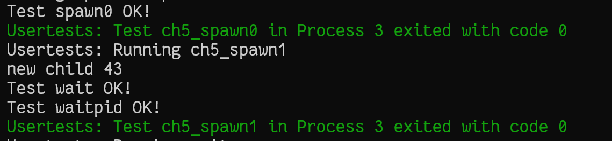

# rCore 实验 - Lab5

### 简介

- 关于 rCore-Tutorial-Book 第五章的一些笔记
- 请搭配 rCore-Tutorial-Book 食用
- 很多细节被省略了，这篇文章只是大概梳理一下思路

### 根据应用名加载应用程序

- 修改 `src/build.rs` 脚本，将应用程序名数组写到内核当中
- 在 `loader.rs` 模块中根据应用程序名找到在数组中的下标，然后根据下标来获取 `elf` 文件数据

### 进程管理与切换（task 子模块）

- `pid.rs`：新建 `pid` 和 `kernel_stack` 数据结构，将 `pid` 与 `kernel_stack` 与 `TCB` 进行绑定起来，而不是像前一章在 `config.rs` 中计算内核栈地址

- `manager.rs`：静态的进程管理，向外提供插入新的进程，以及取出就绪进程的接口

  ```rust
  pub fn add_task(task: Arc<TaskControlBlock>) {
      TASK_MANAGER.exclusive_access().add(task);
  }
  pub fn fetch_task() -> Option<Arc<TaskControlBlock>> {
      TASK_MANAGER.exclusive_access().fetch()
  }
  ```

- `processor.rs`：记录当前运行的进程，向外提供接口： `take_current_task`、`current_task`、`current_user_token`、`current_trap_cx`、`schedule`

- `task.rs` 对进程控制块 `TCB` 进一步封装，可以根据 `elf` 文件来构造 `TCB`

- `mod.rs` 提前将 `initproc` 进程添加到就绪队列中，作为所有进程的父节点，并且提供进程切换相关的函数：`suspend_current_and_run_next`、`exit_current_and_run_next`

### 扩展系统调用，支持进程的动态管理

- `sys_getpid`：获取进程 `pid`

- `sys_fork` ，需要 `TCB` 提供 `fork` 函数根据当前进程的地址空间来构造子进程的地址空间（具体的实现在 `memory_set.rs` 中），维护进程之间的父子关系，

  ```rust
  // TaskControlBlock::fork()
  pub fn fork(self: &Arc<TaskControlBlock>) -> Arc<TaskControlBlock> {
  	let mut parent_inner = self.inner_exclusive_access();
  	// 先根据当前进程地址空间来构造子进程地址空间
  	let memory_set = MemorySet::from_existed_user(&parent_inner.memory_set);
  	let trap_cx_ppn = memory_set
  		.translate(VirtAddr::from(TRAP_CONTEXT).into())
  		.unwrap()
  		.ppn();
      // 分配 pid 和 kernel_stack
  	let pid_handle = pid_alloc();
  	let kernel_stack = KernelStack::new(&pid_handle);
  	let kernel_stack_top = kernel_stack.get_top();
  	// 构造子进程的 TCB
  	let task_control_block = Arc::new(TaskControlBlock {
  		pid: pid_handle,
  		kernel_stack,
  		inner: unsafe {
  			UPSafeCell::new(TaskControlBlockInner {
  				trap_cx_ppn,
  				base_size: parent_inner.base_size,
  				task_cx: TaskContext::goto_trap_return(kernel_stack_top),
  				task_status: TaskStatus::Ready,
  				memory_set,
  				parent: Some(Arc::downgrade(self)),
  				children: Vec::new(),
  				exit_code: 0,
  				task_info: TaskInfo::new(),
  				last_start_time: 0,
  			})
  		},
  	});
  	// 维护进程之间的父子关系
  	parent_inner.children.push(task_control_block.clone());
  	let trap_cx = task_control_block.inner_exclusive_access().get_trap_cx();
  	trap_cx.kernel_sp = kernel_stack_top;
  	task_control_block
  }
  // syscall/process.rs  sys_fork
  pub fn sys_fork() -> isize {
      let current_task = current_task().unwrap();
      // 构造子进程的 TCB
      let new_task = current_task.fork();
      let new_pid = new_task.pid.0;
      // 修改子进程的 sys_fork 返回值
      let trap_cx = new_task.inner_exclusive_access().get_trap_cx();
      trap_cx.x[10] = 0;
      // 将子进程添加进就绪队列
      add_task(new_task);
      // 父进程 sys_fork 的返回值为子进程的 pid
      new_pid as isize
  }
  ```

- `sys_exec`：先获取到对应的进程的 `elf` 文件数据，然后使用 `TCB` 提供 `exec` 函数

  ```rust
  // TaskControlBlock::exec()
  pub fn exec(&self, elf_data: &[u8]) {
  	// 构造新的地址空间
      let (memory_set, user_sp, entry_point) = MemorySet::from_elf(elf_data);
      let trap_cx_ppn = memory_set
      	.translate(VirtAddr::from(TRAP_CONTEXT).into())
          .unwrap()
          .ppn();
  
  	// 替换地址空间、trap_cx_ppn、TrapContext
      let mut inner = self.inner_exclusive_access();
      inner.memory_set = memory_set;
      inner.trap_cx_ppn = trap_cx_ppn;
      let trap_cx = inner.get_trap_cx();
      *trap_cx = TrapContext::app_init_context(
      	entry_point,
          user_sp,
          KERNEL_SPACE.exclusive_access().token(),
          self.kernel_stack.get_top(),
          trap_handler as usize,
      );
  }
  // syscall/process.rs  sys_exec
  pub fn sys_exec(path: *const u8) -> isize {
      let token = current_user_token();
      let path = translated_str(token, path);
      if let Some(data) = get_app_data_by_name(path.as_str()) {
          let task = current_task().unwrap();
          task.exec(data);
          0
      } else {
          -1
      }
  }
  ```

- `sys_waitpid`：根据 `pid`来进行相关的处理，若当前进程的子进程中没有对应 `pid` 的子进程，则返回 -1，若找到了子进程，但是子进程正在执行，则返回 -2，正常情况下会直接回收掉对用的子进程

  ```rust
  pub fn sys_waitpid(pid: isize, exit_code_ptr: *mut i32) -> isize {
      let task = current_task().unwrap();
      let mut inner = task.inner_exclusive_access();
      if !inner
          .children
          .iter()
          .any(|p| pid == -1 || pid as usize == p.getpid()) {
          return -1;
      }
      let pair = inner.children.iter().enumerate().find(|(_, p)| {
          p.inner_exclusive_access().is_zombie() && (pid == -1 || pid as usize == p.getpid())
      });
      if let Some((idx, _)) = pair {
          let child = inner.children.remove(idx);
          assert_eq!(Arc::strong_count(&child), 1);
          let found_pid = child.getpid();
          let exit_code = child.inner_exclusive_access().exit_code;
          *translated_refmut(inner.memory_set.token(), exit_code_ptr) = exit_code;
          found_pid as isize
      } else {
          -2
      }
  }
  ```

### 扩展内核与进程之间的数据转换

- `page_table.rs`增加了 `translated_str`、`translated_refmut<T>`接口

- `address.rs` 增加了 `PhysAddr::get_mut<T>` 方法，获取物理页上的数据

### 终端 user_shell

- 首先实现 sys_read 系统调用，读取 `StdIn`
- 命令解析函数，用 `String` 存放命令，遇到 `'\0'` 就执行 `fork` 系统调用

### 实验练习

- `spawn` 创建进程，将 `fork` 和 `exec` 两个系统调用整合到一起，先将应用名转化到内核中，然后利用在 `TCB` 中实现的 `spawn` 方法构建新进程的 `TCB` 

  ```rust
  // syscall/process sys_spawn
  pub fn sys_spawn(path: *const u8) -> isize {
      let token = current_user_token();
      let path = translated_str(token, path);
      if let Some(data) = get_app_data_by_name(path.as_str()) {
          let current_task = current_task().unwrap();
          let new_task = current_task.spawn(data);
          let new_pid = new_task.pid.0;
          add_task(new_task);
          new_pid as isize
      } else {
          -1
      }
  }
  // TaskControlBlock::spawn
  pub fn spawn(self: &Arc<TaskControlBlock>, elf_data: &[u8]) -> Arc<TaskControlBlock> {
  	let mut parent_inner = self.inner_exclusive_access();
      // 构建地址空间
      let (memory_set, user_sp, entry_point) = MemorySet::from_elf(elf_data);
      let trap_cx_ppn = memory_set
      	.translate(VirtAddr::from(TRAP_CONTEXT).into())
          .unwrap()
          .ppn();
      // 分配 pid 和 kernel_stack
      let pid_handle = pid_alloc();
      let kernel_stack = KernelStack::new(&pid_handle);
      let kernel_stack_top = kernel_stack.get_top();
      let task_control_block = Arc::new(TaskControlBlock {
      pid: pid_handle,
      kernel_stack,
      inner: unsafe {
      	UPSafeCell::new(TaskControlBlockInner {
          	trap_cx_ppn,
              base_size: user_sp,
              task_cx: TaskContext::goto_trap_return(kernel_stack_top),
              task_status: TaskStatus::Ready,
              memory_set,
              parent: Some(Arc::downgrade(self)),
              children: Vec::new(),
              exit_code: 0,
              last_start_time: 0,
              task_info: TaskInfo::new(),
              })
          },
      });
      // 维护进程父子关系
      parent_inner.children.push(task_control_block.clone());
      let trap_cx = task_control_block.inner_exclusive_access().get_trap_cx();
      // 修改 TrapContext
      *trap_cx = TrapContext::app_init_context(
      	entry_point,
          user_sp,
          KERNEL_SPACE.exclusive_access().token(),
          kernel_stack_top,
          trap_handler as usize,
      );
      task_control_block
  }
  ```

- 在应用程序库中添加相应的接口

- 实验结果，通过第五章所有测试

  