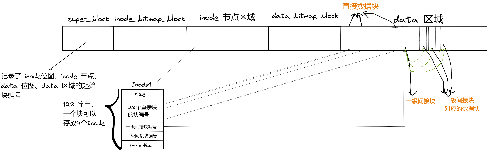

# rCore 实验 - Lab6

### 简介

- 关于 rCore-Tutorial-Book 第六章的一些笔记
- 请搭配 rCore-Tutorial-Book 食用
- 很多细节被省略了，这篇文章只是大概梳理一下思路

### easy-fs 文件系统

- `block_dev.rs` 定义了 `BlockDevice` 特性，能够读写块

- `block_cache.rs` 在内核中最多建立 512 字节 * 16 的缓冲区

- `layout.rs` 和 `bitmap.rs` 构建磁盘布局

  

  一个块可以存放 4 个 `Inode` ，因此计算 `inode_id` 时不仅需要 `block_id` 还需要 `offset`

- `vfs.rs` 提供在内存中使用的 `Inode` 数据结构，并且提供相关的接口

  > new：新建一个文件 Inode
  >
  > read_disk_inode<V>：对文件进行读
  >
  > modify_disk_inode<V>：对文件写
  >
  > find_inode_id：根据文件名查找 inode_id
  >
  > find：根据文件名查找 inode
  >
  > increase_size：增加 inode 的大小
  >
  > create：根据文件名创建一个新的文件 Inode
  >
  > ls：列出当前 Inode 下的 Inode
  >
  > read_at：从 offset 处开始读文件
  >
  > write_at：从 offset 处开始写文件
  >
  > clear：清空文件内容

- `efs.rs` 提供对文件系统和 `Inode` 管理的接口

  > create：根据 total_blocks 和 inode_bitmap_blocks 来计算出 data_bitmap_block 和 data_area_block，创建文件系统
  >
  > open：打开文件系统
  >
  > root_inode：获取文件系统的根节点
  >
  > get_disk_inode_pos：根据 inode_id 得到 inode 所在的 block_id 以及 offset
  >
  > get_data_block_id：根据 data_block_id 得到在块设备上的块编号
  >
  > alloc_inode：分配一个 inode
  >
  > alloc_data：分配一个数据块
  >
  > dealloc_data：回收数据块

### 内核实现文件系统的接口

- 在 `boards` 和 `drivers` 模块中添加相关的设置，将 `virtio` 端口映射到 `0x10001000 ~ 0x10002000` 这一块区域，并添加在内核的地址空间中

  ```
  // memory_set::new_kernel
  for pair in MMIO {
  	memory_set.push(
  	MapArea::new(
  		(*pair).0.into(),
  		((*pair).0 + (*pair).1).into(),
  		MapType::Identical,
  		MapPermission::R | MapPermission::W,
  	),
  	None,
  	);
  }
  ```

- 内核新增 `fs` 子模块

  - `inode.rs` 定义了在内核中的 `OSInode` 数据结构，实现了 `File` 特性，向外提供了 `open_file` 接口
  - 为 `stdout`、`stdin` 实现 `File` 特性

### 让应用程序进行文件操作

- 在 `TaskControlBlock` 中新增 `fd_table` 向量，其中存放的是实现了 `File` 特性的数据结构，可以是 `OSinode` 、`stdout`、`stdin`、管道等，并且修改创建进程的相关函数

- 修改 `os/Makefile` 文件，使用 `easy-fs-fuse` 中的脚本，将应用程序编译后写入到 `fs-img` 块设备中，并且启动 `qemu` 时加载块设备

  ```
  fs-img: $(APPS)
  	@cd ../user && make build
  	@rm -f $(FS_IMG)
  	@cd ../easy-fs-fuse && cargo run --release -- -s ../user/src/bin/ -t ../user/target/riscv64gc-unknown-none-elf/release/
  
  @qemu-system-riscv64 \
  	-machine virt \
      -nographic \
      -bios $(BOOTLOADER) \
      -device loader,file=$(KERNEL_BIN),addr=$(KERNEL_ENTRY_PA) \
      -drive file=$(FS_IMG),if=none,format=raw,id=x0 \
      -device virtio-blk-device,drive=x0,bus=virtio-mmio-bus.0
  ```

### 实验练习，sys_link、sys_unlink、sys_stat 系统调用

- `syscall` 子模块增加相应接口

- `fs/inode.rs`、`easy-fs/vfs.rs` 中实现 `linkat`、`unlinkat`、`fstat` 函数

  - `linkat`：在根节点中先找到旧文件名对应的文件的 `inode_id`，然后创建新文件的目录，指向 `inode_id`

    ```
    pub fn linkat(&self, newname: &str, oldname: &str) {
    	let mut fs = self.fs.lock();
        let mut inode_id = 0;
        self.modify_disk_inode(|root_inode| {
        // append file in the dirent
        let file_count = (root_inode.size as usize) / DIRENT_SZ;
        let new_size = (file_count + 1) * DIRENT_SZ;
        // increase size
        self.increase_size(new_size as u32, root_inode, &mut fs);
        // write dirent
        inode_id = self.find_inode_id(oldname, root_inode).unwrap();
        let dirent = DirEntry::new(newname, inode_id);
        	root_inode.write_at(
            	file_count * DIRENT_SZ,
                dirent.as_bytes(),
                &self.block_device,
            );
        });
    }
    ```

  - `unlinkat`：在根节点中找到文件名对应的目录，然后删除目录

    ```
    pub fn unlinkat(&self, name: &str) -> isize {
    	self.modify_disk_inode(|root_inode| {
        	let file_count = (root_inode.size as usize) / DIRENT_SZ;
        	for i in 0..file_count {
        		let mut dirent = DirEntry::empty();
            	assert_eq!(root_inode.read_at(i * DIRENT_SZ, dirent.as_bytes_mut(), &self.block_device,),DIRENT_SZ,);
            	if dirent.name() == name {
            		let temp = DirEntry::empty();
                    root_inode.write_at(
                		DIRENT_SZ * i,
                    	temp.as_bytes(),
                    	&self.block_device,
                	);
                	return 0;
            	}
        	}
        	return -1;
        })
    }
    ```

  - `fstat`：提供的接口是文件的 `fd`，然而进程的 `fd_table` 中存放的是实现了 `File` 特性的数据结构，并不一定是 `OSInode`，因此，我直接在 `File` 特性中新增了 `fstat` 方法（对 `Rust` 不熟悉，只能采用这种方法了），但是需要先实现根据 `block_id` 和 `offset` 获取 `inode_id` 的方法。 统计文件的引用计数时，需要遍历目录。

    ```
    // File trait
    fn fstat(&self) -> (u64, StatMode, u32) {
    	let inner = self.inner.exclusive_access();
        let inode = &inner.inode;
        let (ino, dir_flag, nlink) = ROOT_INODE.fstat(inode);
        if dir_flag {
        	(ino, StatMode::DIR, nlink)
        } else {
        	(ino, StatMode::FILE, nlink)
        }
    }
    
    // vfs.rs fstat
    pub fn fstat(&self, inode: &Arc<Inode>) -> (u64, bool, u32) {
    	let inode_id = inode.get_inode_id() as u32;
        let mut nlink = 0usize;
        self.read_disk_inode(|root_inode| {
        	let file_count = (root_inode.size as usize) / DIRENT_SZ;
            let mut dirent = DirEntry::empty();
            for i in 0..file_count {
            	assert_eq!(
                	root_inode.read_at(i * DIRENT_SZ, dirent.as_bytes_mut(), &self.block_device,),DIRENT_SZ,
                );
                if dirent.inode_number() == inode_id {
                	nlink += 1;
                }
            }
        });
        let dir_flag = inode.read_disk_inode(|disk_inode| {
        	disk_inode.is_dir()
        });
        (inode_id as u64, dir_flag, nlink as u32)
    }
    ```

- 实验结果，通过第六章所有测试

  