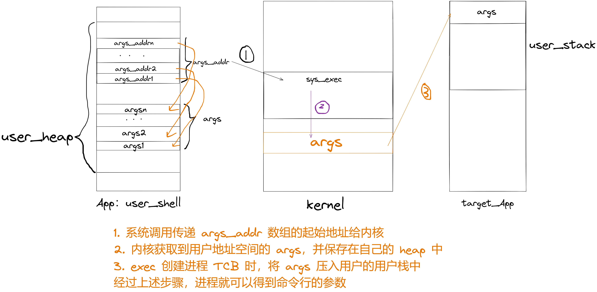
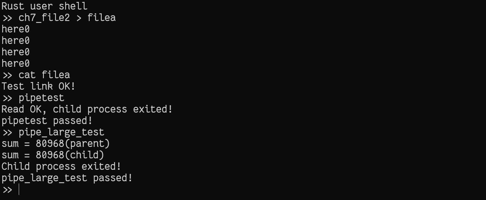
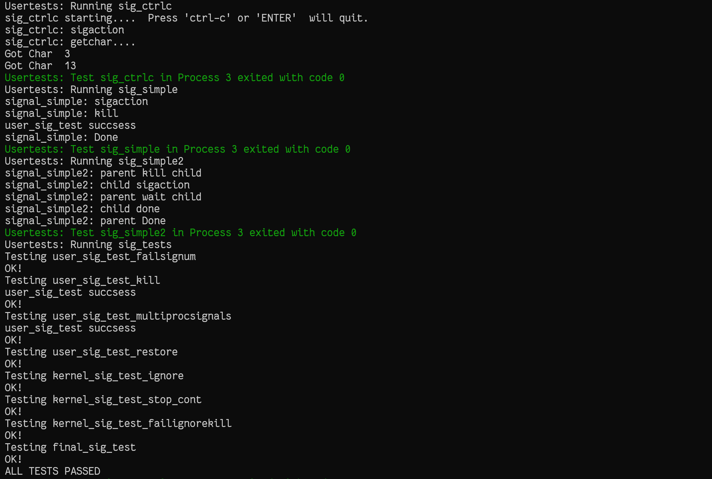

# rCore 实验 - Lab7

### 简介

- 关于 rCore-Tutorial-Book 第七章的一些笔记
- 请搭配 rCore-Tutorial-Book 食用
- 很多细节被省略了，这篇文章只是大概梳理一下思路

### 标准输入输出

- 在进程 `TCB` 中增加了 `fd_table`，并且在创建进程时将 `stdin`、`stdout`、`stderr` 放到进程的 `fd_table` 中，并且在动态的管理进程时，增加对 `fd_table` 的相关操作


### 管道机制

- 管道实际上只是内存中的一段缓冲区，只不过被抽象成文件，供两个进程进行单向通信，向外提供了 `make_pipe` 接口

  ```rust
  pub struct Pipe {
      readable: bool,
      writable: bool,
      buffer: Arc<UPSafeCell<PipeRingBuffer>>,
  }
  // Pipe 缓冲区，设计成环形队列，保存了一个写端的弱引用，在写时会被升级为强引用
  pub struct PipeRingBuffer {
      arr: [u8; RING_BUFFER_SIZE],
      head: usize,
      tail: usize,
      status: RingBufferStatus,
      write_end: Option<Weak<Pipe>>,
  }
  ```

- 在内核中系统调用中新增相关的接口，只能单向通信，调用 `sys_pipe` 的进程会同时在 `fd_table` 中保存 `pipe` 两端的文件描述符，在返回到用户态之后需要关闭另一个文件描述符

  ```rust
  pub fn sys_pipe(pipe: *mut usize) -> isize {
      let task = current_task().unwrap();
      let token = current_user_token();
      let mut inner = task.inner_exclusive_access();
      let (pipe_read, pipe_write) = make_pipe();
      let read_fd = inner.alloc_fd();
      inner.fd_table[read_fd] = Some(pipe_read);
      let write_fd = inner.alloc_fd();
      inner.fd_table[write_fd] = Some(pipe_write);
      *translated_refmut(token, pipe) = read_fd;
      *translated_refmut(token, unsafe { pipe.add(1) }) = write_fd;
      0
  }
  ```

### I/O 重定向

- 读取命令行参数，在 `user_shell.rs` 中创建 `ProcessArguments`  数据结构，在 `main` 函数中读取命令，对命令进行解析，判断是否有 `|` 以及重定向标识符

  ```rust
  #[derive(Debug)]
  struct ProcessArguments {
      input: String,              // 输入文件名
      output: String,             // 输出文件名
      args_copy: Vec<String>,     // 具体参数
      args_addr: Vec<*const u8>,  // 每个参数的起始地址
  }
  ```

- 应用程序库修改 `sys_exec` 系统调用接口，增加命令行参数

  ```rust
  pub fn exec(path: &str, args: &[*const u8]) -> isize {
      sys_exec(path, args)
  }
  ```

- 命令行参数的传递以及进程获取用户栈中的命令行参数

  ```rust
  // syscall/process sys_exec 获取 user_shell 进程地址空间参数
  pub fn sys_exec(path: *const u8, mut args: *const usize) -> isize {
      let token = current_user_token();
      let path = translated_str(token, path);
      let mut args_vec: Vec<String> = Vec::new();
      loop {
          let arg_str_ptr = *translated_ref(token, args);
          if arg_str_ptr == 0 {
              break;
          }
          args_vec.push(translated_str(token, arg_str_ptr as *const u8));
          unsafe {
              args = args.add(1);
          }
      }
      if let Some(app_inode) = open_file(path.as_str(), OpenFlags::RDONLY) {
          let all_data = app_inode.read_all();
          let task = current_task().unwrap();
          let argc = args_vec.len();
          task.exec(all_data.as_slice(), args_vec);
          // return argc because cx.x[10] will be covered with it later
          argc as isize
      } else {
          -1
      }
  }
  
  // task.rs TaskControlBlock::exec 将参数压入 target_app 的用户栈
  pub fn exec(&self, elf_data: &[u8], args: Vec<String>) {
  	……
  	// 压入参数到用户栈
      user_sp -= (args.len() + 1) * core::mem::size_of::<usize>();
      let argv_base = user_sp;
      let mut argv: Vec<_> = (0..=args.len()).map(|arg| {
      	translated_refmut(
          	memory_set.token(),
              (argv_base + arg * core::mem::size_of::<usize>()) as *mut usize,
          )
      }).collect();
      *argv[args.len()] = 0;
      for i in 0..args.len() {
      	user_sp -= args[i].len() + 1;
          *argv[i] = user_sp;
          let mut p = user_sp;
          for c in args[i].as_bytes() {
          	*translated_refmut(memory_set.token(), p as *mut u8) = *c;
              p += 1;
          }
          *translated_refmut(memory_set.token(), p as *mut u8) = 0;
      }
      // make the user_sp aligned to 8B for k210 platform
      user_sp -= user_sp % core::mem::size_of::<usize>();
  	……
  }
  
  // user/src/lib.rs 进程获取用户栈中的参数
  pub extern "C" fn _start(argc: usize, argv: usize) -> ! {
      unsafe {
          HEAP.lock()
              .init(HEAP_SPACE.as_ptr() as usize, USER_HEAP_SIZE);
      }
      let mut v: Vec<&'static str> = Vec::new();
      for i in 0..argc {
          let str_start =
              unsafe { ((argv + i * core::mem::size_of::<usize>()) as *const usize).read_volatile() };
          let len = (0usize..)
              .find(|i| unsafe { ((str_start + *i) as *const u8).read_volatile() == 0 })
              .unwrap();
          v.push(
              core::str::from_utf8(unsafe {
                  core::slice::from_raw_parts(str_start as *const u8, len)
              })
              .unwrap(),
          );
      }
      exit(main(argc, v.as_slice()));
  }
  ```

  具体示意图

  

- 测试用例结果

  

### 信号机制

- 类似于硬件中断的软件级异步通知机制，需要提供 4 个系统调用接口

  > `sys_sigaction`: 设置信号处理例程
  >
  > `sys_sigprocmask`: 设置要阻止的信号
  >
  > `sys_kill`: 将某信号发送给某进程
  >
  > `sys_sigreturn`: 清除堆栈帧，从信号处理例程返回

- 让进程支持信号机制

  - 在进程 `TCB` 中增加信号机制相关的成员变量，并且在 `new`、`fork` 时对这部分初始化

  - `TCB` 中需要新增一个 `TrapContext` 备份，用来记录进程正常陷入内核时的上下文

  - 每个进程都有一个信号处理表 `signal_actions`，其中记录了信号处理例程的地址以及标志位，上述系统调用就是对信号处理例程进行设置，`sys_sigaction` 的主要工作就是保存该进程的 `signal_actions` 中对应信号的 `sigaction` 到 `old_action` 中，然后再把新的 `ref_action` 保存到该进程的 `signal_actions` 对应项中。

    ```rust
    pub fn sys_sigaction(
        signum: i32,
        action: *const SignalAction,
        old_action: *mut SignalAction,
    ) -> isize {
        let token = current_user_token();
        if let Some(task) = current_task() {
            let mut inner = task.inner_exclusive_access();
            if signum as usize > MAX_SIG {
                return -1;
            }
            if let Some(flag) = SignalFlags::from_bits(1 << signum) {
                if check_sigaction_error(flag, action as usize, old_action as usize) {
                    return -1;
                }
                let old_kernel_action = inner.signal_actions.table[signum as usize];
                if old_kernel_action.mask != SignalFlags::from_bits(40).unwrap() {
                    *translated_refmut(token, old_action) = old_kernel_action;
                } else {
                    let mut ref_old_action = *translated_refmut(token, old_action);
                    ref_old_action.handler = old_kernel_action.handler;
                }
                let ref_action = translated_ref(token, action);
                inner.signal_actions.table[signum as usize] = *ref_action;
                return 0;
            }
        }
        -1
    }
    ```

- 进程对信号的处理流程

  - 进程在进入内核时，先进行正常的处理，执行完毕后在进入用户态时，会检查自己是否收到了信号 `check_pending_signals`，如果收到信号，则会调用 `call_user_signal_handler` 或者 `call_kernel_signal_handler` ，对进程的 `TrapContext` 中的 `sepc` 进行修改，使其返回用户态时进入到进程的信号处理例程

    ```rust
    // trap/mod.rs
    pub fn trap_handler() -> ! {
        set_kernel_trap_entry();
        let scause = scause::read();
        let stval = stval::read();
        match scause.cause() {
            ……
        }
        // 处理信号
        handle_signals();
        ……
        trap_return();
    }
    
    // task/mod.rs
    pub fn handle_signals() {
        check_pending_signals();
        loop {
            ……
            check_pending_signals();
            suspend_current_and_run_next()
        }
    }
    
    fn check_pending_signals() {
        ……
        call_kernel_signal_handler(signal);
        call_user_signal_handler(sig, signal);
        ……
    }
    
    fn call_user_signal_handler(sig: usize, signal: SignalFlags) {
        ……
        trap_ctx.sepc = handler;
    	……
    }
    ```

  - 信号处理例程执行完毕后，调用`sys_sigretrun` 系统调用，将进程 `TCB` 的 `TrapContext` 恢复成信号处理之前的备份，之后返回用户态即可回到进程正常的运行流程

    ```rust
    pub fn sys_sigretrun() -> isize {
        if let Some(task) = current_task() {
            let mut inner = task.inner_exclusive_access();
            inner.handling_sig = -1;
            // restore the trap context
            let trap_ctx = inner.get_trap_cx();
            *trap_ctx = inner.trap_ctx_backup.unwrap();
            0
        } else {
            -1
        }
    }
    ```

- 测试用例结果

  