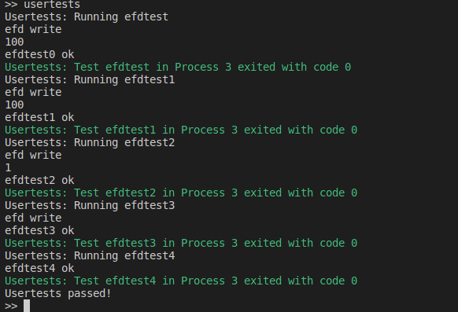

# rCore 实验 - Lab8

### 简介

- 关于 rCore-Tutorial-Book 第八章的一些笔记
- 请搭配 rCore-Tutorial-Book 食用
- 很多细节被省略了，这篇文章只是大概梳理一下思路

### 内核支持线程

- 任务控制块转化为线程控制块 `TaskControlBlock` ，创建进程控制块 `ProcessControlBlock` ，并且对创建进程的相关方法进行修改

  ```
  // 进程控制块
  pub struct ProcessControlBlock {
      // immutable
      pub pid: PidHandle,
      // mutable
      inner: UPSafeCell<ProcessControlBlockInner>,
  }
  pub struct ProcessControlBlockInner {
      ……
      pub tasks: Vec<Option<Arc<TaskControlBlock>>>,  // 进程中的线程
  	……
  }
  // 线程控制块
  pub struct TaskControlBlock {
      // immutable
      pub process: Weak<ProcessControlBlock>,
      pub kstack: KernelStack,
      // mutable
      inner: UPSafeCell<TaskControlBlockInner>,
  }
  pub struct TaskControlBlockInner {
      pub res: Option<TaskUserRes>,  // 线程 id、用户栈地址、所属进程
      pub trap_cx_ppn: PhysPageNum,
      pub task_cx: TaskContext,
      pub task_status: TaskStatus,
      pub exit_code: Option<i32>,
  }
  ```

- 线程管理机制

  - 创建进程时，会在进程内创建一个主线程，进程运行实际上是运行主线程
  - `manager` 的管理对象变成了线程，因此调用 `thread_create` 系统调用时，会直接从线程进入内核，此时需要额外获取所属的进程，然后再创建新的线程，维护好进程、线程之间的关系，并且将新的线程加入到就绪队列中
  - 线程退出根据线程的 `tid`，若为主线程则回收整个进程，若为其他线程，则回收掉线程占用的资源即可

- 对线程和进程的设计，充分体现了进程是资源的分配单位，线程是 `cpu` 的分配单位

### 同步互斥机制

- 锁机制，对外提供 `lock` 和 `unlock` 接口，会记录被阻塞的线程

  ```
  pub struct MutexBlocking {
      inner: UPSafeCell<MutexBlockingInner>,
  }
  pub struct MutexBlockingInner {
      locked: bool,
      wait_queue: VecDeque<Arc<TaskControlBlock>>,
  }
  ```

- 信号量机制，对外提供 `up` 和 `down` 接口，会记录被阻塞的线程，与锁机制类似

  ```
  pub struct Semaphore {
      pub inner: UPSafeCell<SemaphoreInner>,
  }
  pub struct SemaphoreInner {
      pub count: isize,
      pub wait_queue: VecDeque<Arc<TaskControlBlock>>,
  }
  ```

- 条件变量机制，同锁机制和信号量机制类似，但是内部并不维护标志位，操作系统需要显式地施加某种控制

  ```
  pub struct Condvar {
      pub inner: UPSafeCell<CondvarInner>,
  }
  pub struct CondvarInner {
      pub wait_queue: VecDeque<Arc<TaskControlBlock>>,
  }
  ```

- 上述同步互斥机制是内核提供的数据结构，好需要在进程内部维护好相应的信息

  ```
  pub struct ProcessControlBlockInner {
  	……
      pub mutex_list: Vec<Option<Arc<dyn Mutex>>>,
      pub semaphore_list: Vec<Option<Arc<Semaphore>>>,
      pub condvar_list: Vec<Option<Arc<Condvar>>>,
  }
  ```

### 实验练习

- `eventfd` 系统调用

  - 创建 `Eventfd` 数据结构，实现 `new` 方法

    ```
    pub struct Eventfd {
    	readable: bool,
    	writable: bool,
    	inner: Arc<UPSafeCell<EventfdInner>>,
    }
    struct EventfdInner {
    	pub is_sema: bool,
        pub is_nonblock: bool,
    	pub val: u64,
    }
    const EFD_SEMAPHORE: i32 = 1;
    const EFD_NONBLOCK: i32 = 2048;
    impl Eventfd {
    	pub fn new(val: u64, flag: i32) -> Arc<Self> {
    		let mut is_sema = true;
            let mut is_nonblock = true;
    		if (flag & EFD_SEMAPHORE) == 0 {
    			is_sema = false;
    		}
            if (flag & EFD_NONBLOCK) == 0 {
    			is_nonblock = false;
    		}
    		Arc::new(Self {
    			readable: true,
    			writable: true,
    			inner: Arc::new(unsafe {
    				UPSafeCell::new(EventfdInner {
    					is_sema: is_sema,
                        is_nonblock: is_nonblock,
    					val: val,
    				})
    			}),
    		})
    	}
    }
    ```

  - 实现 `File` 特性，在读文件时通过外部的 `loop` 循环来保证可以在计数值为零时可以阻塞当前线程，读写通过 `byteorder` 依赖包的来完成 `UserBuffer` 与 `u64` 之间的转化

    ```
    impl File for Eventfd {
    	fn readable(&self) -> bool {
            self.readable
        }
        fn writable(&self) -> bool {
            self.writable
        }
        fn read(&self, mut buf: UserBuffer) -> usize {
            loop {
                let mut inner = self.inner.exclusive_access();
                if inner.val == 0 {     // 读取失败
                    if inner.is_nonblock {
                        return usize::MAX;
                    } else {    // 应该阻塞线程
                        drop(inner);
                        suspend_current_and_run_next();
                        continue;
                    }
                } else {
                    let mut res = 0u64;
                    if inner.is_sema {
                        res = 1u64;
                        inner.val -= 1;
                    } else {
                        res = inner.val;
                        inner.val = 0;
                    }
                    for slice in buf.buffers.iter_mut() {
                        assert_eq!(8, slice.len());
                        BigEndian::write_u64(*slice, res);
                    }
                    return 0;
                }
            }
        }
        fn write(&self, buf: UserBuffer) -> usize {
            let mut inner = self.inner.exclusive_access();
            // 先将缓冲区的数据转化成 u64
            for slice in buf.buffers.iter() {
                assert_eq!(8, slice.len());
                if inner.is_sema {
                    inner.val += 1;
                } else {
                    let val = BigEndian::read_u64(*slice);
                    inner.val += val;
                }
            }
            0
        }
    }
    ```

  - 在内核的系统调用中提供相关的接口 `sys_eventfd` 创建一个 `Eventfd`，之后对则通过 `write`、`read`系统调用完成读写

  - 实验结果，补充了第八章的测试用例，分别对信号量 + 阻塞模式、信号量 + 非阻塞模式、非信号量 + 阻塞模式、非信号量 + 非阻塞模式进行了测试，均达到预期的效果

    