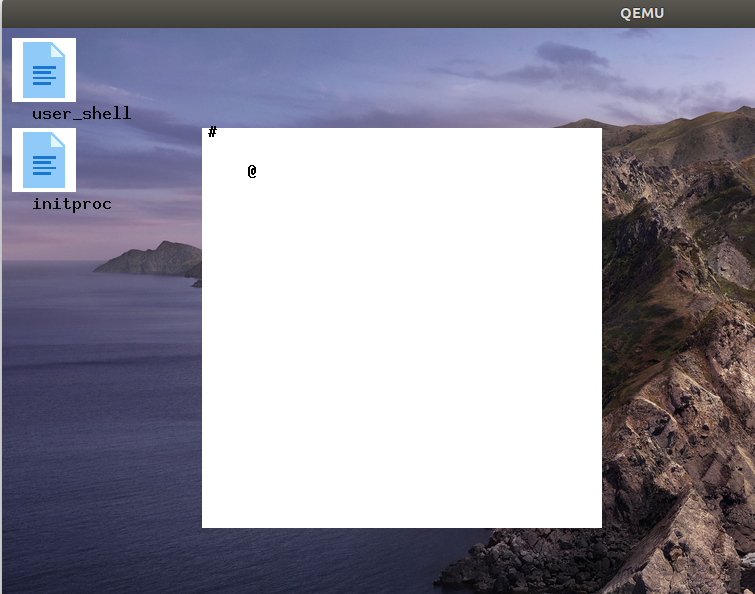
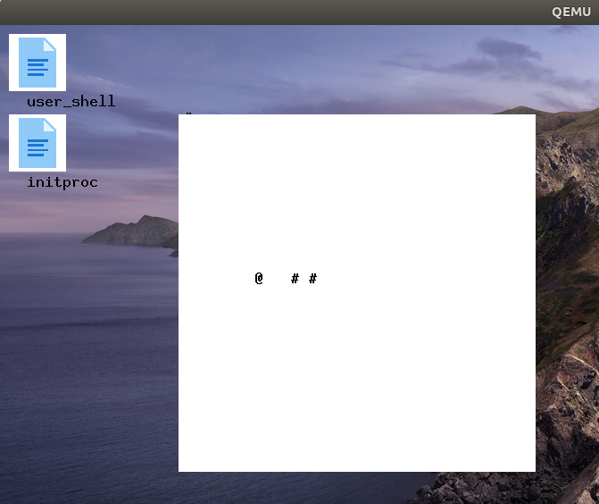

# rCore 实验 - Lab9

### 简介

- 关于 rCore-Tutorial-Book 第九章的一些笔记
- 请搭配 rCore-Tutorial-Book 食用
- 很多细节被省略了，这篇文章只是大概梳理一下思路

### 关于运行指导书 Demo 中遇到的问题

- 网络问题：直接下载对应的依赖到本地，并更改 `Cargo.toml` 中的依赖路径

- 不要尝试使用最新的 `rust` 工具链，因为最新的工具链没有使用某些特性或者宏，例如 `llvm_asm`

- `virtio-gpu` 测试通过之后，并没出现图形界面，只显示 `VNC server running on 127.0.0.1：5900`

  - 需要安装 `SDL` 开发库，并且对 `qemu` 重新编译，使其支持 `SDL`

    ```
    cd qemu-5.0.0
    ./configure --target-list=riscv64-softmmu,riscv64-linux-user --enable-sdl
    make
    make install
    ```

### 让内核处理外设中断

- bootloader 会先检测设备信息，解析设备树（详见https://github.com/YdrMaster/rustsbi-qemu/blob/main/rustsbi-qemu/src/main.rs），保存到一个全局变量 BOARD_INFO 中，之后直接在 bootloader 中完成对设备的初始化
- 平台级中断控制器（PLIC，drivers/plic.rs）让操作系统处理外设中断。
  - 在 board 模块的 device_init() 函数中完成 PLIC 的初始化，设置好外设中断优先级、外设中断的阈值，激活外设中断
  - 把 sie 寄存器中的 seie 位设置为 1 `sie::set_sext();`
  - 在 board 模块的 irq_handler() 函数完成对具体外设中断处理的转发
  - 外设产生中断之后，scause 寄存器中会记录中断的类型，PLIC 的 Claim 寄存器会保存具体的外设中断类型（5 keyboard, 6 mouse, 8 block, 10 uart），然后进入到 irq_handler() 外设中断处理函数，根据 PLIC 的 Claim 寄存器保存的信息，进入到具体的外设处理函数
  - 操作系统处理完毕之后，将 PLIC 的 Complete 寄存器设置为对应的中断源 id 来告知 PLIC 已经处理完毕

### 操作系统的设备驱动程序

- 串口设备驱动程序（字符设备驱动程序），对外设进行封装，还提供了一个读的缓冲区，发生中断时，外设的字符会保存在 ns16550a 的 lsr 寄存器中，中断处理程序会将这些字符读取到读缓冲区中，并且会唤醒阻塞在这个设备上的线程，线程读写则是在缓冲区上进行，没有字符时会阻塞自己

  ```rust
  struct NS16550aInner {
      ns16550a: NS16550aRaw,
      read_buffer: VecDeque<u8>,
  }
  // CharDeviceImpl，封装了一个条件变量，在读取时没有字符会阻塞当前线程
  pub struct NS16550a<const BASE_ADDR: usize> {
      inner: UPIntrFreeCell<NS16550aInner>,
      condvar: Condvar,
  }
  impl<const BASE_ADDR: usize> CharDevice for NS16550a<BASE_ADDR> {
      fn read(&self) -> u8 {
          loop {
              let mut inner = self.inner.exclusive_access();
              if let Some(ch) = inner.read_buffer.pop_front() {
                  return ch;
              } else {
                  let task_cx_ptr = self.condvar.wait_no_sched();
                  drop(inner);
                  schedule(task_cx_ptr);
              }
          }
      }
      fn write(&self, ch: u8) {
          let mut inner = self.inner.exclusive_access();
          inner.ns16550a.write(ch);
      }
      fn handle_irq(&self) {
          let mut count = 0;
          self.inner.exclusive_session(|inner| {
              while let Some(ch) = inner.ns16550a.read() {
                  count += 1;
                  inner.read_buffer.push_back(ch);
              }
          });
          if count > 0 {
              self.condvar.signal();
          }
      }
  }
  ```

- 块设备驱动程序，对外设进行封装，外设中有一个队列用于缓冲，还封装了一组条件变量，因为读取块设备时是通过 block_id，因此如果没有准备好，需要将线程阻塞在这个块上面，因此需要将 block_id 以及 Condvar 封装成 BTreeMap，发生中断时，操作系统会知道某个块已经准备好了，因此会将阻塞在那个块上的线程唤醒，此处不再列出代码

  ```rust
  pub struct VirtIOBlock {
      virtio_blk: UPIntrFreeCell<VirtIOBlk<'static>>,
      condvars: BTreeMap<u16, Condvar>,
  }
  ```

- gpu 设备驱动程序，对块设备进行封装，还封装了 framebuffer，详见（virtio-drivers），内核对 gpu 的操作，实际上只是对 framebuffer 的刷新

  ```rust
  pub struct VirtIOGPU {
      gpu: UPIntrFreeCell<VirtIOGpu<'static>>,
      fb: &'static [u8],
  }
  ```

- 输入设备（键盘、鼠标）驱动程序，定义了 INPUTDevice 特性，包括一个 handle_irq() 函数，目前只实现了键盘按下、鼠标的中断处理（似乎 virtio-drivers 中的 pop_pending_event() 存在 bug，从事件队列中取出事件之后，又重新入队了，而事件队列只有 32 个大小的缓冲区，导致键盘和鼠标输入只会处理很少的事件）

  ```rust
  impl INPUTDevice for VirtIOINPUT {
      fn handle_irq(&self) {
          let mut input = self.0.exclusive_access();
          input.ack_interrupt();
          let event = input.pop_pending_event().unwrap();
          let dtype = match Decoder::decode(
              event.event_type as usize,
              event.code as usize,
              event.value as usize,
          ) {
              Ok(dtype) => dtype,
              Err(_) => return,
          };
          match dtype {
              virtio_input_decoder::DecodeType::Key(key, r#type) => {
                  println!("{:?} {:?}", key, r#type);
                  if r#type == KeyType::Press {
                      let mut inner = PAD.exclusive_access();
                      let a = inner.as_ref().unwrap();
                      match key.to_char() {
                          Ok(mut k) => {
                              if k == '\r' {
                                  a.repaint(k.to_string() + "\n")
                              } else {
                                  a.repaint(k.to_string())
                              }
                          }
                          Err(_) => {}
                      }
                  }
              }
              virtio_input_decoder::DecodeType::Mouse(mouse) => println!("{:?}", mouse),
          }
      }
  }
  ```

### GUI 组件

所有的组件都是直接操作 framebuffer 来显示出来，因此每个组件需要一个 graphic 来记录位置和大小

- graphic
- button、icon、image、panel 

### 实验：贪吃蛇游戏

在实验前，我纠结了很久，到底是完全实现整个框架，还是只为了完成这个游戏，最终思考了很久，还是决定只完成实验，但是前面的之前的思考也进行了记录

- 创建 desktop 对象，记录当前的 main_window，以及所有打开的 window，输入设备的中断最终是交给 main_window 来处理，进而再传递给具体的组件来进行响应

  ```rust
  lazy_static::lazy_static!{
      pub static ref DESKTOP: Arc<Desktop> = Arc::new(Desktop::new());
  }
  
  pub struct Desktop {
      pub main_window: Arc<Window>,
      inner: UPIntrFreeCell<DesktopInner>,
  }
  
  pub struct DesktopInner {
      windows: VecDeque<Arc<Window>>,
  }
  ```

- 基于 window 来管理各个组件以及消息传递等（实现了 component 特性）

  ```rust
  pub struct Window {
      inner: UPIntrFreeCell<WindowInner>,
  }
  
  pub struct WindowInner {  
      size: Size,
      point: Point,  
      titel: Option<String>,
      comps: VecDeque<Arc<dyn Component>>,
  }
  ```

- 游戏的具体实现

  - 创建 SnakeGame 对象，包括一个 panel、food 以及 snake，其中 food 用 Button 来表示，snake 则用 VecDeque 来表示，直接利用 button 的 paint 方法来画图，不用再额外写一个直接操作 point 画图的函数，在创建 SnakeGame 时，food 以及 snake 的位置直接固定了，创建的代码不再贴在此处

    ```rust
    pub struct SnakeGame {
        inner: UPIntrFreeCell<SnakeInner>,
    }
    
    pub struct SnakeInner {
        graphic: Graphics,
        pub panel: Arc<Panel>,
        pub food: Button,
        pub snake: VecDeque<Button>,
    }
    ```

  - 关于 snake 移动的处理，需要在移动之前判定是否能够吃到 food，如果能够吃到 food，则只需要在头部添加一个新的 Button，如果不能吃到 food，则在将尾部的 Button 弹出来，将其移动到正确的位置，然后添加到头部，VecDeque 刚好可以满足这个需求，在吃点 food 之后，需要再随即生成 food 的位置

  - 对键盘输入事件的处理，这里是通过 w\a\s\d 让 snake 上下移动，利用了 virtio_input_decoder 依赖包来解析按键输入

- 最终效果如图

  

