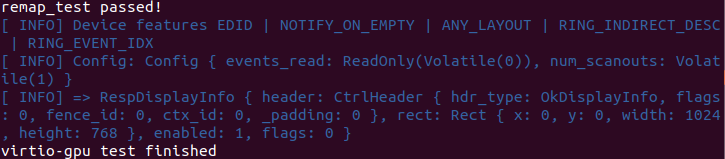
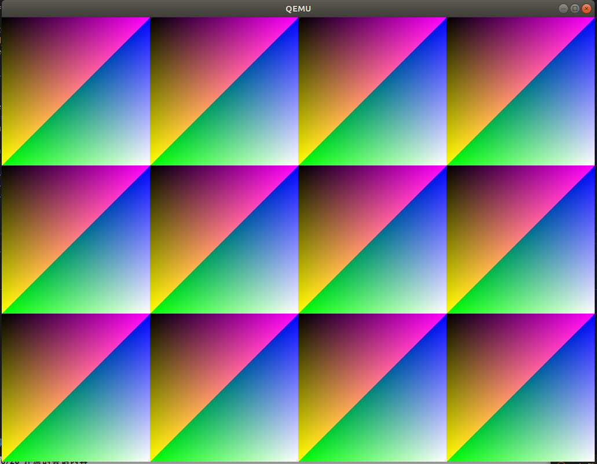

# rCore 实验 - Lab9

### 简介

- 关于 rCore-Tutorial-Book 第九章的一些笔记
- 请搭配 rCore-Tutorial-Book 食用
- 很多细节被省略了，这篇文章只是大概梳理一下思路

### 关于运行指导书 Demo 中遇到的问题

- 网络问题：直接下载对应的依赖到本地，并更改 `Cargo.toml` 中的依赖路径

- 不要尝试使用最新的 `rust` 工具链，因为最新的工具链没有使用某些特性或者宏，例如 `llvm_asm`

- `virtio-gpu` 测试通过之后，并没出现图形界面，只显示 `VNC server running on 127.0.0.1：5900`

  - 需要安装 `SDL` 开发库，并且对 `qemu` 重新编译，使其支持 `SDL`

    > ```
    > cd qemu-5.0.0
    > ./configure --target-list=riscv64-softmmu,riscv64-linux-user --enable-sdl
    > make
    > make install
    > ```

### 在内核中添加 VirtIO-GPU 驱动（尚未完成，还需要对缓冲区进行封装）

- 在 `os/Makefile` 文件中启动 `qemu` 的指令中添加 `virtio-gpu-device` 设备，并将其挂在到总线上

  ```
  qemu-system-riscv64 \
  		-machine virt \
  		-nographic \
  		-bios $(BOOTLOADER) \
  		-device loader,file=$(KERNEL_BIN),addr=$(KERNEL_ENTRY_PA) \
  		-drive file=$(FS_IMG),if=none,format=raw,id=x0 \
          -device virtio-blk-device,drive=x0,bus=virtio-mmio-bus.0 \
  		-device virtio-gpu-device,bus=virtio-mmio-bus.1
  ```

- 更改 `board` 模块中的 `mmio` 设置，保证内核建立对应的地址空间映射

  ```
  pub const MMIO: &[(usize, usize)] = &[(0x10001000, 0x2000)];
  ```

- 对 `drivers` 模块重构，参考 `virtio-drivers` 依赖包中样例的实现方法，将 `virtio_dma_alloc` 、`virtio_dma_dealloc` 单独放在 `drivers/mod.rs` 中，新建 `gpu` 子模块，仿照 `block` 子模块实现 `VirtioGpu` 数据结构，实现对 `virtio-drivers` 依赖中的 `VirtioGpu` 进行封装

  - `drivers/mod.rs`

    ```
    pub mod block;
    pub mod gpu;
    
    pub use block::BLOCK_DEVICE;
    pub use gpu::GPU_DEVICE;
    pub use gpu::gpu_device_test;
    pub use block::block_device_test;
    
    use crate::mm::{
        frame_alloc, frame_dealloc, kernel_token, FrameTracker, PageTable, PhysAddr, PhysPageNum,
        StepByOne, VirtAddr,
    };
    use lazy_static::*;
    use crate::sync::UPSafeCell;
    use alloc::vec::{Vec};
    lazy_static! {
        static ref QUEUE_FRAMES: UPSafeCell<Vec<FrameTracker>> = unsafe { UPSafeCell::new(Vec::new()) };
    }
    #[no_mangle]
    pub extern "C" fn virtio_dma_alloc(pages: usize) -> PhysAddr {
        let mut ppn_base = PhysPageNum(0);
        for i in 0..pages {
            let frame = frame_alloc().unwrap();
            if i == 0 {
                ppn_base = frame.ppn;
            }
            assert_eq!(frame.ppn.0, ppn_base.0 + i);
            QUEUE_FRAMES.exclusive_access().push(frame);
        }
        ppn_base.into()
    }
    #[no_mangle]
    pub extern "C" fn virtio_dma_dealloc(pa: PhysAddr, pages: usize) -> i32 {
        let mut ppn_base: PhysPageNum = pa.into();
        for _ in 0..pages {
            frame_dealloc(ppn_base);
            ppn_base.step();
        }
        0
    }
    #[no_mangle]
    pub extern "C" fn virtio_phys_to_virt(paddr: PhysAddr) -> VirtAddr {
        VirtAddr(paddr.0)
    }
    #[no_mangle]
    pub extern "C" fn virtio_virt_to_phys(vaddr: VirtAddr) -> PhysAddr {
        PageTable::from_token(kernel_token())
            .translate_va(vaddr)
            .unwrap()
    }
    ```

  - `drivers/gpu/virtio_gpu.rs`

    ```
    use crate::sync::UPSafeCell;
    use virtio_drivers::{VirtIOGpu, VirtIOHeader};
    #[allow(unused)]
    const VIRTIO0: usize = 0x10002000;
    
    pub struct VirtioGpu(UPSafeCell<VirtIOGpu<'static>>);
    
    impl VirtioGpu {
        #[allow(unused)]
        pub fn new() -> Self {
            let mut virt_head_ptr = VIRTIO0 as *mut VirtIOHeader;
            unsafe {
                // virt_head_ptr = virt_head_ptr.add(1);
                Self(UPSafeCell::new(
                    VirtIOGpu::new(&mut *(virt_head_ptr)).unwrap(),
                ))
            }
        }
        pub fn test(&self) {
            let mut inner = self.0.exclusive_access();
            let fb = inner.setup_framebuffer().unwrap();
            for y in 0..768 {
                for x in 0..1024 {
                    let idx = (y * 1024 + x) * 4;
                    fb[idx] = x as u8;
                    fb[idx + 1] = y as u8;
                    fb[idx + 2] = (x + y) as u8;
                }
            }
            drop(inner);
            println!("virtio-gpu test finished");
        }
    }
    
    impl Default for VirtioGpu {
        fn default() -> Self {
            Self::new()
        }
    }
    ```

  - `drivers/gpu/mod.rs`

    ```
    mod virtio_gpu;
    pub use virtio_gpu::VirtioGpu;
    use crate::board::GpuImpl;
    use alloc::sync::Arc;
    use lazy_static::*;
    
    lazy_static! {
        pub static ref GPU_DEVICE: Arc<GpuImpl> = Arc::new(GpuImpl::new());
    }
    
    #[allow(unused)]
    pub fn gpu_device_test() {
        let ref mut gpu_device = GPU_DEVICE.clone();
        gpu_device.test();
    }
    ```

- 在 `main.rs` 中添加对 `gpu` 的测试，结果如下

  
  